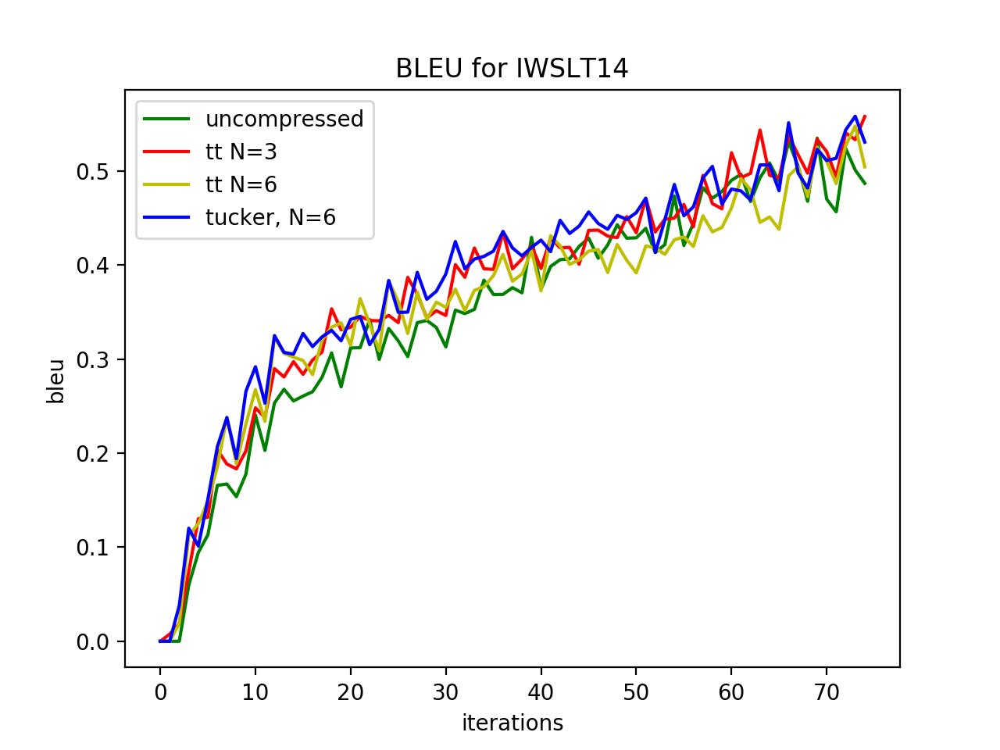

# Compressed Transformer


○ Application of tensors method for compression neural machine translation model  ○
 


The project support training and translation with trained model without beam search.

Note that this project is still a work in progress.

> We use WMT16 (Multi30k) dataset and IWSLT14 for our experiments.

> To learn more about Transformer you could read "[Annotated Transformer](http://nlp.seas.harvard.edu/2018/04/03/attention.html)"  


## Main Results
We have reduced the model up to **2.6** times for IWSLT14 dataset. 
Without embeddings layer, our model is less than the original one up to **6.2** times using small ranks.

It turned out that you can effortlessly reduce the number of parameters of the model 
based on a transformer by *2* using tensor decomposition *without loss of quality*. 

-------------------------------

In this project we explore the compression techniques which can both decrease the size of the model and 
speed up inference. We evaluate and compare several compression techniques in the context of two layer MLP on MNIST task.
We pick the best of them Tensor Train and Tucker methods and show its efficacy for state of the art NLP model,
i.e. Transformer Network 

   
## Requirments
* pytorch 0.4.1+
* nltk
* torchtext
For MNIST experiments
* Install tntorch


## Run NMT

* Run (with cuda, if it's available):

```
PYTHONPATH="." python3 nmt/train.py --seed 45  --save_model_after 1000 \
 --valid_max_num 120  --lower --min_freq 3 --lower --tokenize --batch 82
 ```
 
 
 For train compressed model:

```
PYTHONPATH="." python3 nmt/train.py --seed 45  --save_model_after 1000 \
 --valid_max_num 120  --lower --min_freq 3 --lower --tokenize --batch 82 \
 --compress --compress_mode tt --exp compressed

 ```
 
 _Note 1_: use multi-gpu mode via parameters ```--multi-gpu --num_devices #``` 
 
 _Note 2_: default decomposition is Tensor Train, but you can try Tucker via ```--compress_mode tucker``` (preferable)
 
 For test use:
 ```
 sh scripts/run_test.sh $path_to_your_uncompressed_model
 ```
 
 or for compressed:
  ```
 sh scripts/run_test_compressed.sh $path_to_your_compressed_model
 ```
 
## How model can be compressed?
The Feed-Forward network is a simple block with one hidden linear layer 
and one projection layer. The most popular choice for the dimensions are 512 x 2048 for the hidden layer 
and  2048x512 for the projection layer,
 so in one Feed-Forward network we have $2^{21}$ parameters and this block is repeated in each of the 
 2N Transformer blocks.
  That is why we decided to compress these parts of the model. 
  We applied method of tensoring neural networks to every linear layer in
   the feed-forward block to obtain significant compression. 

Each first layer is represented as a tensor with  2x4x8x4x2 
input modes and 4x4x8x4x4 output modes respectively 
and the second layer has these parameters in the reverse order.
Every tensor is decomposed with one of the tensor decomposition method. We refer to [2].  
 
## Results

### Fully-compressed model

We conducted experiments for the Tucker's decomposition
 applied to all matrices except embeddings and projection for logits.
 
In this setting, we achieve the highest compression ration:
 (up to 2.6 for full model and up to 6.2 without embeddings)
 
 | dataset | Test |  Compression <br>  Rate | 
 |-------- | -------| -----------------|
 | Multi30k | | |
 | IWSLT 14 | | |


### Multi30k

An example of training for the WMT'16 Multimodal Translation task (http://www.statmt.org/wmt16/multimodal-task.html).


Please, use the batch as large as possible.  
Net can converge After 5 epoch with batch size 128.


Train set contains 29100 pairs of sentences (ge-en).
 
Total numbers of parameters in the model:  64231918

Num of the epoch - 20, batch size - 150
small-transformer model has 3 block-layers instead of 6


| Method         | BLEU | N_comp/N  |  Compression <br>  Rate | Time |
|:----------------|:---------|---------| :-------------- | :------|
| original model |  0.442 |  0/6   |  1.0 |  41.38 |
| tt-transformer | 0.407 | 6/6 | 1.644 | 84.56 |
| small-transformer | 0.403 | 0/3 | 1.6 | - |
| tt-small-transformer | 0.396 | 3/3 | 2.1713 | 34.94 |
| tt-transformer | 0.468  | 5/6 |  1.484 |  59.833 |
| tt-transformer | 0.455  | 4/6 | 1.353 | 60.4 |
| tt-transformer | 0.472 | 3/6 |  1.243 | 45.28 |
| tt-transformer | 0.450 | 2/6 | 1.150 | 43.97
| tt-transformer | 0.369 | 1/6 | 1.07 | 34.63
| tucker | 0.447 | 6/6 | 1.64 | 43.83 |
 
num parameters in tucker: 39062062

tt with max_rank = 2
Num parameters in compress fc layer 416


| Method            | BLEU   |  Compression <br>  Rate      | Time   |
| :---------------- | :----- | :--------------------------- | :----- |
| original model    | 0\.442 | 1\.0                         | 41\.38 |
| all tt2           | 0\.434 | **1\.65**                    | 76\.89 |
| 5/6 tt2           | 0\.489 | 1\.485                       | 75\.24 |
| 3/6 tt2           | 0\.412 | 1\.243                       | 71\.36 |
| 1/6 tt2           | 0\.414 | 1\.069                       | 40\.97 |
| small-transformer | 0\.403 | 1\.6                         | 31\.28 |
| tt4               | 0\.407 | 1\.64                        | 84\.56 |
| 1/2 tt4           | 0\.472 | 1\.24                        | 45\.28 |
| Tucker            | 0\.447 | 1\.64                        | 43\.83 |

We use tt-decomposition for every fc layer in encoder and decoder  in the following way:
- ranks of the first layer   : 2x4x4x2
- ranks of  the second layer : 4x4x4x4
(ones-dimensions have been omitted)

Compression ratio is the ration of #(original parameters) to #(parameters in compressed networks) 


### IWSLT14
Note: for experiments with IWSLT we use batch size 256 and 4 GPU with at least 10gb of memory.

It's interesting that network with less parameters can be train in more efficiently way with small batch.

 | model | bleu-valid | bleu-test | time |
 | ------ | ---- | ---- | ---- |
 | transformer | 0.165 |  0.1363 | 146.16 |
 | compressed 5| 0.212 | 0.197 | 237.97 |
 | compressed 3| 0.212 | 0.192 | 187.35 |
 
 
 TT and tucker used with rank=2
 
 | model | bleu| time | 
 | ------ | ---- | ---- |
 | transformer | 0.291 | 154.23 | 
 | compressed 6| 0.292 | 241.24 | 
 | compressed 3| 0.297 | 180.81 |
 | tucker | 0.283 | 198.3 |
 
 
 *time for inference
 
  

 
 Results for small batch: 
 
 
 
 
  
  

## MNIST experiments

| Method                     |  Test <br>  Accuracy  |  Compression <br>  Rate  |
| :------------------------- | :-------------------: | :----------------------: |
| Original Model             | 0\.9770               | 1\.00                    |
| Magnitude Pruning          | 0\.9546               | 8\.15                    |
| SVD                        | 0\.9669               | 7\.54                    |
| SVD + Fine-Tuning          | 0\.9641               | 12\.68                   |
| Variational Dropout        | 0\.9841               | 23\.39                   |
| Tucker                     | 0\.9247               | 28\.82                   |
| Tensor Train               | 0\.8507               | **72\.02**               |
| Tensor Train + Fine-Tuning | 0\.9620               | **72\.02**               |
 


## Feedback

If you have ideas or find mistakes [please leave a note](https://github.com/khakulin/compressed-transformer/issues/new).
  
## TODO
-coming soon

## Citation
Use this bibtex entry to cite the repository:

@misc{compressed_transformer,
  title={Compresed Transformer},
  author={},
  year={2019},
  publisher={Github},
  journal={GitHub repository},
  howpublished={\url{https://github.com/khakhulin/Compressed-transformer}},
}


## References

1. Vaswani, Ashish, et al. ["Attention is all you need."](https://arxiv.org/abs/1706.03762.pdf) Advances in Neural Information Processing Systems. 2017.
2. Novikov, Alexander, et al. ["Tensorizing neural networks."](https://arxiv.org/pdf/1509.06569.pdf) Advances in Neural Information Processing Systems. 2015.
3. Rush, Alexander, et al. ["The Annotated Transformer"])(http://aclweb.org/anthology/W18-2509)  NLP Open Source Software, 2018