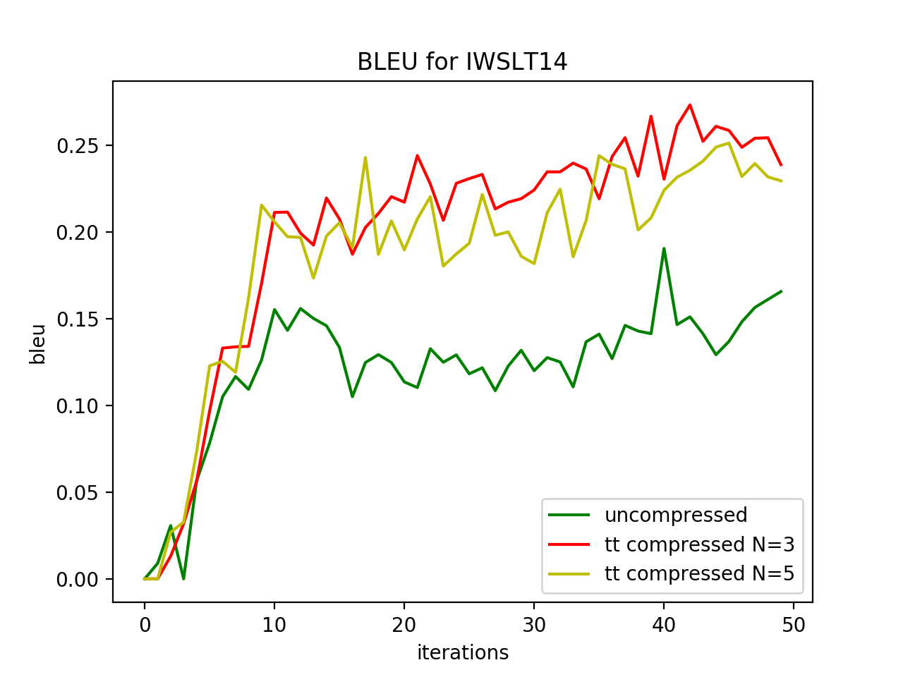

# Compressed Transformer

We use WMT16 (Multi30k) dataset. 
Please, use the batch as large as possible. 
Net can converge After 5 epoch with batch size 128.
   
## Requirments

* Install nltk
* Install tntorch
* Install torchtext


## Run NMT

* Run (with cuda, if it's available):

```
PYTHONPATH="." python3 nmt/train.py --seed 45  --save_model_after 1000 \
 --valid_max_num 120  --lower --min_freq 3 --lower --tokenize --batch 82
 ```
 
 
 For train compressed model:

```
PYTHONPATH="." python3 nmt/train.py --seed 45  --save_model_after 1000 \
 --valid_max_num 120  --lower --min_freq 3 --lower --tokenize --batch 82 \
 --compress --compress_mode tt --exp compressed

 ```
 
 _Note 1_: use multi-gpu mode via parameters ```--multi-gpu --num_devices 2``` 
 
 _Note 2_: default decomposition is Tensor Train, but you can try Tucker via ```--compress_mode tucker```
 
 For test use:
 ```
 sh scripts/run_test.sh $path_to_your_uncompressed_model
 ```
 or for compressed:
  ```
 sh scripts/run_test_compressed.sh $path_to_your_compressed_model
 ```
 
## Results

### Multi30k
Train set contains 29100 pairs of sentences (ge-en).
 
Total numbers of parameters in the model:  64231918

Num of the epoch - 20, batch size - 150
small-transformer model has 3 block-layers instead of 6


| method         | test, bleu  | N_comp/N  | Compress_ratio | Time |
|----------------|---------|---------| -------------- |------|
| original model |  0.442 |  0/6   |  1.0 |  41.38 |
| tt-transformer | 0.407 | 6/6 | 1.644 | 84.56 |
| small-transformer | 0.403 | 0/3 | 1.6 | - |
| tt-small-transformer | 0.396 | 3/3 | 2.1713 | 34.94 |
| tt-transformer | 0.468  | 5/6 |  1.484 |  59.833 |
| tt-transformer | 0.455  | 4/6 | 1.353 | 60.4 |
| tt-transformer | 0.472 | 3/6 |  1.243 | 45.28 |
| tt-transformer | 0.450 | 2/6 | 1.150 | 43.97
| tt-transformer | 0.369 | 1/6 | 1.07 | 34.63

 

We use tt-decomposition for every fc layer in encoder and decoder  in the following way:
- ranks of the first layer   : 2x4x4x2
- ranks of  the second layer : 4x4x4x4
(ones-dimensions have been omitted)

Compression ratio is the ration of #(original parameters) to #(parameters in compressed networks) 


### IWSLT14

It's interesting that network with less parameters can be train in more efficiently.

 | model | bleu-valid | bleu-test | time |
 | ------ | ---- | ---- | ---- |
 | transformer | 0.165 |  0.1363 | 146.16 |
 | compressed 5| 0.212 | 0.197 | 237.97 |
 | compressed 3| 0.212 | 0.192 | 187.35 |
 
 
 *time for inference
 
 
 
 
  
